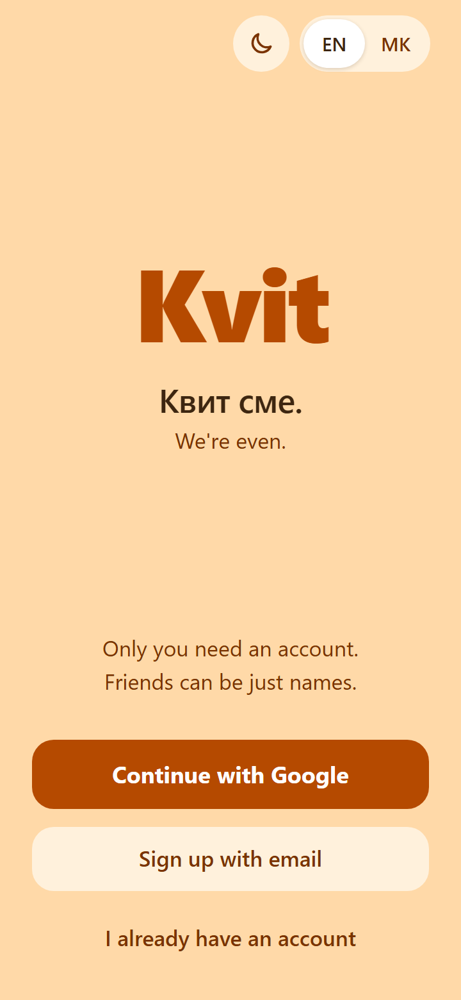
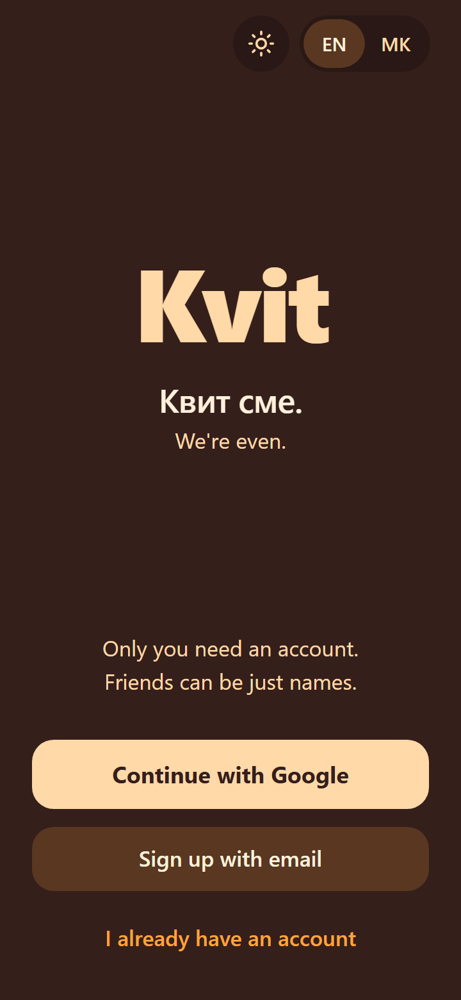
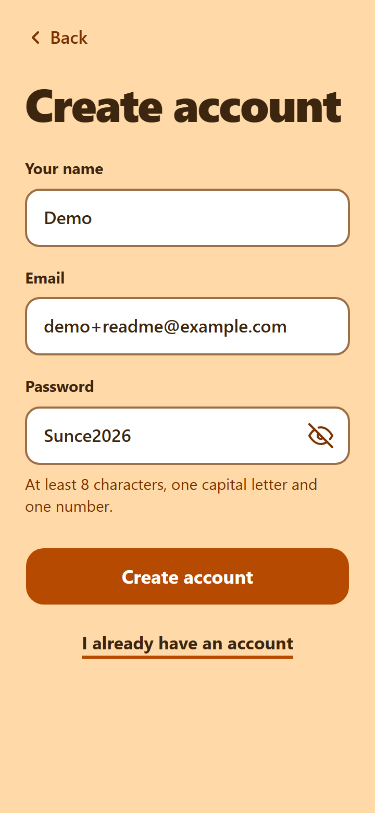
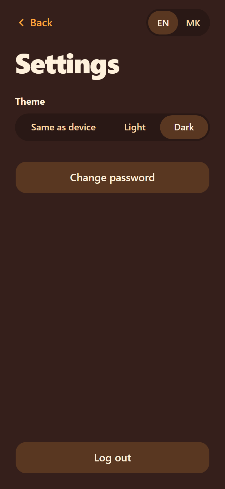

# Kvit

**Квит сме.** ("We're even.")

**Try it: https://kvit-mk.pages.dev**

Kvit splits shared expenses with friends and family, shows who pays whom in as few payments as possible, and keeps a personal budget. It works in **Macedonian denars and euros** and in **English and Macedonian**.

> **Status: early, in development.** Built so far: the backend and frontend skeletons (Phases 1 and 2), the money core with its tests (Phase 3), and email accounts with sign-up, log-in and settings (Phase 4). Phase 5, the first free deploy, is in progress: the site above is live, but today you can only create an account, log in and change your settings. Groups and expenses come next. See the [roadmap](docs/ROADMAP.md).

## Screenshots
Real screens of the running app at phone size.

<table>
  <tr>
    <th>Welcome, light</th>
    <th>Welcome, dark</th>
    <th>Sign up</th>
    <th>Settings, dark</th>
  </tr>
  <tr>
    <td></td>
    <td></td>
    <td></td>
    <td></td>
  </tr>
</table>

## What works today
- **Accounts with email and password:** sign up (name, email, password), log in, log out. Login lasts 90 days in a secure cookie.
- **Protection:** an account locks for a while after repeated wrong passwords, and sign-up and log-in are rate-limited per visitor.
- **Password reset by hand:** there is no email sending, so the owner resets a forgotten password with a small script. The user gets a temporary password and must choose a new one on the next log-in.
- **Settings:** language, theme (same as device, light or dark), change password, log out.
- **English and Macedonian** on every screen, **light and dark** mode. A one-tap light/dark button on the Welcome screen lets visitors see dark mode without an account, and every password field has a show/hide button.
- **The money core** (not on screen yet): amounts, the four ways to split, balances per currency and debt simplification, all covered by tests.

## What it will do
**Next in Release 1: splitting**
- Sign in with Google, and a privacy page.
- Groups for a trip, a household or a single bill. Friends without an account can be added by name, so only one person needs to sign up.
- Four ways to split an expense: **equally** (with extras, e.g. "Marko took the better room, +600"), **exact amounts**, **percentages** and **shares**.
- Balances per currency. MKD and EUR are never mixed, and each euro expense keeps the National Bank exchange rate from the day it was saved.
- "Who pays whom", simplified to fewer payments with the same totals.
- Settling up with confirmation: "I paid Ana" counts once Ana confirms it.
- An activity feed with change history ("1,200 → 1,500"), Undo instead of "Are you sure?" pop-ups, and a home dashboard.

**Later: Release 2 (budget).** Categories and monthly limits, income (once or repeating), and your share of group expenses counted in your budget automatically.

**Later: Release 3 (polish).** An offline queue for when the server is waking up, and a usage-statistics page.

## Built for speed
Every screen is judged by how few taps it needs. The goal for adding an expense is **2 taps plus the amount**: the other fields start with the most common choice (paid by me, split equally, today).

## Tech stack
| Part | Technology |
|---|---|
| API | .NET 10, ASP.NET Core Web API, EF Core 10 + PostgreSQL 18, ASP.NET Core Identity (Google sign-in is planned) |
| Web | React, TypeScript, Vite, TanStack Query, React Router, react-i18next, Tailwind CSS + shadcn/ui |
| Tests | xUnit + Testcontainers (a real PostgreSQL in Docker), Vitest |
| Hosting | Neon (database), Render (API in Docker), Cloudflare Pages (website), GitHub Actions (CI). All free, with no card |

## Tests and CI
The project has automated tests on both sides: **508 backend tests** (xUnit, the database tests run against a real PostgreSQL in Docker through Testcontainers) and **467 frontend tests** (Vitest), all passing on 2026-10-01.

GitHub Actions builds both parts, runs every test, builds the Docker image, checks that no database change is missing a migration and, on `main`, applies the migrations to the online database.

## Interesting parts
- **Money is whole numbers.** Amounts are stored as integer minor units (deni and cents), never floating point. Splits always add up exactly to the total, and a group's balances always add up to zero. Both rules are covered by tests.
- **Debt simplification** runs separately for each currency.
- **Clean Architecture + CQRS** with a small hand-written dispatcher instead of MediatR, rich domain entities, and a `Result` pattern instead of exceptions for business rules.
- **Login across two hosts.** The website and the API live on different domains, and Safari blocks cookies between sites. A Cloudflare Pages Function forwards `/api/*`, so the browser sees one site and a secure login cookie works everywhere.
- **Only the website can reach the API.** The Pages Function adds a shared secret and the visitor's address to every forwarded request. The API refuses requests without the secret, and rate limits count the address the proxy reports, so a made-up header cannot dodge them.
- **Logins survive restarts.** The keys that sign login cookies are stored encrypted in PostgreSQL, because Render wipes its disk on every restart.
- **Migrations run from CI, not from the app.** An EF Core migration bundle updates the database before the new API version goes live, so the app never touches the database schema when it wakes up.
- **Free hosting that sleeps** (planned). The API sleeps after 15 minutes on the free plan, so the website will show saved data instantly while it wakes, and scheduled work (exchange-rate refresh, closing a group after 24 hours) will run lazily on the next request instead of on a timer.

## Repository layout
```
src/api/     ASP.NET Core API (Api, Application, Domain, Infrastructure, Contracts) and its Dockerfile
src/web/     React app, plus the Cloudflare Pages Function in functions/
tests/       Backend tests (Domain and Api)
scripts/     Small owner scripts (password reset, certificate for the cookie keys)
docs/        Decisions, architecture, data model, screens, roadmap, guides and reports
```

## Running it locally
You need the .NET 10 SDK, Node.js and Docker Desktop. The local database is a PostgreSQL 18 container from `compose.yaml`; the setup steps are in [the local setup guide](docs/guides/phase-04-local-setup.md).

**Backend**, from the repository root:
```
dotnet run --project src/api/Kvit.Api
```
→ `http://localhost:5018` (API reference at `/scalar`, health at `/health` and `/api/health`)

**Frontend**, from `src/web` (needs the backend running first, for the `/api` dev proxy):
```
npm install
npm run dev
```
→ `http://localhost:5173`

Backend checks: `dotnet build Kvit.slnx`, `dotnet test Kvit.slnx` (Docker Desktop must be running).
Frontend checks, from `src/web`: `npm run lint`, `npm run build`, `npm test`.

## Documentation
- [Decisions](docs/DECISIONS.md): every product rule and the reasons behind it
- [Architecture](docs/ARCHITECTURE.md): how the code is structured
- [Data model](docs/DATA-MODEL.md): tables and money rules
- [Screens](docs/SCREENS.md): every screen and its tap count
- [Roadmap](docs/ROADMAP.md) and [status](docs/STATUS.md)
- [Reports](docs/reports/): what each phase built and how it was checked

## License
© 2026 Filip Davchev. All rights reserved. You're welcome to read the code, but no licence to reuse it is granted yet.
