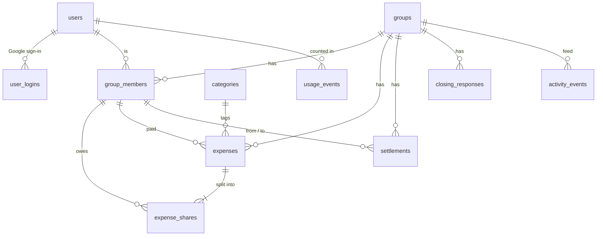

# Kvit: Data model

> Written 2026-09-25 in the building session, from `DECISIONS.md`. Nothing here exists in code yet (NOT VERIFIED by any run).
> **What** each rule means lives in `DECISIONS.md`. This file is **how it's stored**.
> Items marked **(proposal)** wait for Filip's OK. Items marked **(check docs)** are library details to confirm before use.

## Words used in this file
- **Table:** like a spreadsheet tab. Each **row** is one thing (one expense), each **column** one field (its amount).
- **PK (primary key):** the column that identifies a row. **FK (foreign key):** a column that points at a row in another table (an expense's `group_id` points at its group).
- **Minor units:** money stored as a whole number of the smallest coin. 1,200 MKD is stored as `120000` deni, 15.50 EUR as `1550` cents. Whole numbers never have rounding errors; decimals like `0.1 + 0.2` do.
- **Soft delete:** "deleting" only fills in `deleted_at`. The row stays, so **Undo** can bring it back.
- **Migration:** a small generated C# file that creates or changes tables. EF Core runs them in order, so every database (your PC, the tests, Neon) ends up with the same tables.

## Conventions (all tables)
| What | How | Why |
|---|---|---|
| Ids | `uuid`, made by the server with `Guid.CreateVersion7()` (check docs) | Version 7 ids are ordered by time, so the database index stays fast. Nobody can guess the next id |
| Names | `snake_case` tables and columns (`EFCore.NamingConventions`, check docs) | The Postgres convention; plain SQL stays readable |
| Money | `amount_minor bigint` + `currency text` | See "Minor units" above |
| Currency | `text`, only `'MKD'` or `'EUR'` (a check constraint enforces it) | Readable in SQL. A new currency is a code change, not a surprise |
| Enum-like fields | `text` (e.g. `status = 'Pending'`) | Readable in SQL |
| Moments in time | `timestamptz`, always UTC | DECISIONS: everything stored in UTC |
| Calendar dates | `date` (no time) | An expense's date doesn't shift between time zones |
| Soft delete | `deleted_at timestamptz null` + `deleted_by_user_id uuid null` | Undo instead of "Are you sure?" |
| Duplicate protection | `client_request_id uuid null`, unique, on expenses, settlements and personal entries | The phone makes this id. A retried request returns the first result instead of a second row. The columns exist from Release 1 so the outbox (Release 3) needs no table changes |
| Balances | **Never stored.** Always added up from expenses and settlements | A stored total can drift from its rows (a known complaint about Wallet by BudgetBakers). A family group has a few hundred rows, so adding them up is instant |

---

# Release 1 tables



## `users` (ASP.NET Core Identity + Kvit columns)
Identity is Microsoft's ready-made login system. It brings its own `users` table (email, password hash, lockout counters…). Kvit adds a few columns. The id type is `Guid`, not Identity's default `string` (check docs: `IdentityUser<Guid>`).

| Column | Type | Notes |
|---|---|---|
| `id` | uuid PK | |
| `email`, `normalized_email`, `password_hash`, `security_stamp`, lockout columns… | Identity's own | `password_hash` is empty for Google-only accounts |
| `display_name` | text, 1–60 chars | Shown everywhere |
| `language` | text `'en'` / `'mk'` | Starts as the phone's language |
| `time_zone` | text, e.g. `'Europe/Skopje'` | Detected from the phone at sign-up and log-in |
| `is_time_zone_manual` | bool, default false | When true, the phone's zone no longer overwrites it |
| `google_picture_url` | text null | From Google's `profile` scope. Everyone else gets initials on a colour worked out from their id (no column needed) |
| `created_at` | timestamptz | |

Identity's side tables (`user_logins`, `user_claims`, `user_tokens`, `roles`, `user_roles`, `role_claims`) come with it. Kvit uses:
- **`user_logins`** for Google: one row with `login_provider = 'Google'` and `provider_key` = Google's `sub` (the user's permanent Google id).
- **`roles` / `user_roles`** only in Release 3, for Filip's admin role.

## `data_protection_keys`
The keys .NET uses to sign login cookies. Stored here because Render wipes its files on every restart (see ARCHITECTURE traps). Encrypted with a certificate kept in Render's secret settings (`ProtectKeysWithCertificate`, check docs).

| Column | Type |
|---|---|
| `id` | int PK |
| `friendly_name` | text |
| `xml` | text (the encrypted key) |

## `groups`
One table for both "One bill" and "Group" (DECISIONS: same group underneath).

| Column | Type | Notes |
|---|---|---|
| `id` | uuid PK | |
| `kind` | text `'OneBill'` / `'Group'` | |
| `name` | text, 1–60 chars | A one-bill uses its title, or a generated one like "Bill · 25 Sep" |
| `emoji` | text | Picked by the user; a suggested default so it costs no tap. The background colour comes from the id |
| `default_currency` | text | |
| `status` | text `'Open'` / `'Closing'` / `'Finished'` | See "Finishing a group" below |
| `owner_user_id` | uuid FK → users | Exactly one owner |
| `closing_started_at` | timestamptz null | When the owner confirmed closing. The 24-hour clock starts here |
| `finished_at` | timestamptz null | |
| `invite_token` | text, unique | 32 random bytes, written in URL-safe letters (43 characters). The owner can reset it |
| `invite_token_created_at` | timestamptz | |
| `created_by_user_id`, `created_at` | | |
| `deleted_at`, `deleted_by_user_id` | | Owner only, only when every balance is zero |
| `xmin` | Postgres system column, used as a concurrency token (check docs) | If two people change the group's status at the same moment, the second save fails instead of silently overwriting the first |

## `group_members`
A member is either a person with an account (`user_id` set) or a plain name like "Grandma" (`user_id` empty).

| Column | Type | Notes |
|---|---|---|
| `id` | uuid PK | Expenses and settlements point at the **member**, not the user, so plain names work the same way |
| `group_id` | uuid FK → groups | |
| `user_id` | uuid null FK → users | Empty = plain-name member |
| `name` | text, 1–60 chars | The plain name ("Marko"), or the account's name at the moment they joined. Screens show the account's current name while `user_id` is set |
| `joined_at` | timestamptz | "The member who joined earliest" gets ownership if the owner's account is deleted |
| `added_by_user_id` | uuid | |
| `claimed_at` | timestamptz null | When someone said "that's me". **Undo claim** (owner) empties `user_id` and `claimed_at`; `name` still holds "Marko" |
| `removed_at`, `removed_by_user_id` | null | Left or removed. Kept as a row because old expenses point at it. Rejoining through the link brings the same row back |

Unique: one active membership per user per group (`group_id, user_id` where `user_id` is set and `removed_at` is empty).

## `categories`
Built-in categories are seeded in Release 1 because group expenses use them. Custom categories arrive in Release 2 (personal spending only).

| Column | Type | Notes |
|---|---|---|
| `id` | uuid PK | |
| `owner_user_id` | uuid null | Empty = built-in |
| `key` | text null | Built-ins only: the translation key (`food`, `transport`…), so the name appears in EN or MK |
| `name` | text null | Custom categories only |
| `emoji`, `color` | text | `color` is a design-token name, not a hex code |
| `sort_order` | int | |
| `archived_at` | timestamptz null | Custom categories get archived, not deleted, so old entries keep their category |

**Built-in list (proposal, edit freely):** 🍽️ Food & drinks · 🛒 Groceries · 🚕 Transport · 🏨 Accommodation · 🎉 Fun · 🛍️ Shopping · 🧾 Bills · 💊 Health · 🎁 Gifts · 📦 Other.

## `expenses`
| Column | Type | Notes |
|---|---|---|
| `id` | uuid PK | |
| `group_id` | uuid FK → groups | |
| `title` | text null, ≤ 80 chars | Optional (DECISIONS). The list shows the category name when it's empty |
| `note` | text null, ≤ 500 chars | |
| `amount_minor` | bigint, > 0 | |
| `currency` | text | |
| `expense_date` | date | Defaults to "today" in the user's own time zone |
| `category_id` | uuid null FK → categories | Built-in only for group expenses (checked in the domain). Empty by default in Release 1 |
| `paid_by_member_id` | uuid FK → group_members | One payer (several payers is in the backlog) |
| `split_type` | text `'Equal'` / `'Exact'` / `'Percentage'` / `'Shares'` | "Equal + extras" is **Equal** with extras filled in, not a fifth type |
| `mkd_per_eur` | numeric(10,4) | The rate saved with the expense (DECISIONS: "keeps the exchange rate from the day it was saved"). Saved on MKD expenses too, because a user whose budget is in EUR needs it |
| `rate_date` | date | The NBRM date that rate belongs to |
| `created_by_user_id`, `created_at` | | "Whoever added it" can edit and delete it |
| `updated_by_user_id`, `updated_at` | null | |
| `deleted_at`, `deleted_by_user_id` | null | Soft delete + Undo |
| `client_request_id` | uuid null, unique | |

## `expense_shares`
One row per person in the split. The rows of an expense always add up **exactly** to `amount_minor`.

| Column | Type | Notes |
|---|---|---|
| `expense_id` + `member_id` | PK (together) | |
| `input_value` | bigint, ≥ 0 | What was typed, and its meaning depends on the split type: **Equal** = the extra in minor units (0 = none) · **Exact** = the amount · **Percentage** = hundredths of a percent (33.33 % = `3333`, all rows total `10000`) · **Shares** = a whole number of shares |
| `share_minor` | bigint, ≥ 0 | What this person owes, calculated by the domain (see "Money rules") |

## `settlements`
"I paid Ana" / "Marko paid me".

| Column | Type | Notes |
|---|---|---|
| `id` | uuid PK | |
| `group_id` | uuid FK | |
| `from_member_id` | uuid FK → group_members | Who handed over the money |
| `to_member_id` | uuid FK → group_members | Who received it. Must differ from `from_member_id` |
| `amount_minor`, `currency` | | |
| `status` | text `'Pending'` / `'Confirmed'` / `'Rejected'` / `'Cancelled'` | Only `Confirmed` changes balances |
| `recorded_by_user_id`, `created_at` | | |
| `resolved_by_user_id`, `resolved_at` | null | Who confirmed, rejected or cancelled it, and when |
| `deleted_at`, `deleted_by_user_id` | null | For a confirmed settlement entered by mistake: the person who recorded it, or the owner, with Undo (Filip agreed, 2026-09-25) |
| `client_request_id` | uuid null, unique | "Marko paid me" can be queued offline in Release 3 |

**Status rules (from DECISIONS):**
- Recorded by the **payer** ("I paid Ana") → `Pending` until the receiver confirms or rejects. The payer can cancel while it's pending.
- Recorded by the **receiver** ("Marko paid me") → `Confirmed` straight away.
- A **plain-name** payer or receiver: the **owner** acts for them (records, confirms, rejects).

## `closing_responses`
Who has confirmed or objected while a group is "Closing". The rows are cleared when a closing is cancelled or started again; the history stays in the activity feed.

| Column | Type | Notes |
|---|---|---|
| `group_id` + `member_id` | PK | |
| `response` | text `'Confirmed'` / `'Objected'` | An objection cancels the closing at once |
| `reason` | text null, ≤ 200 chars | Optional, for objections |
| `responded_at` | timestamptz | |

## `activity_events`
The group's activity feed **and** its change history (DECISIONS: "Change history is part of the activity feed").

| Column | Type | Notes |
|---|---|---|
| `id` | uuid PK | |
| `group_id` | uuid FK | |
| `actor_user_id` | uuid | Who did it |
| `type` | text | See the list below |
| `expense_id`, `settlement_id`, `member_id` | uuid null | What it's about |
| `changes` | jsonb null | For edits: `[{"field":"amount","old":120000,"new":150000}]` → "Filip changed 1,200 → 1,500" |
| `data` | jsonb null | Facts needed to show the line later: the amount, the name at the time, an objection's reason |
| `created_at` | timestamptz | Indexed with `group_id`, newest first |

`jsonb` is a Postgres column that holds a small JSON document. It suits "a list of changed fields" whose shape differs per event.

**Event types:** `GroupCreated`, `GroupRenamed`, `GroupSettingsChanged`, `InviteLinkReset`, `MemberAdded` (plain name), `MemberJoined`, `MemberClaimed`, `ClaimUndone`, `MemberRemoved`, `MemberLeft`, `OwnershipTransferred`, `ExpenseAdded`, `ExpenseEdited`, `ExpenseDeleted`, `ExpenseRestored`, `SettlementRecorded`, `SettlementConfirmed`, `SettlementRejected`, `SettlementCancelled`, `SettlementDeleted`, `ClosingStarted`, `ClosingConfirmed`, `ClosingObjected`, `ClosingCancelled`, `GroupFinished`, `GroupReopened`, `GroupDeleted`, `GroupRestored`.

## `usage_events`
For the admin statistics page (Release 3), but **recorded from Release 1** so no data is lost. Kept apart from `activity_events` because these are platform counts, never shown inside a group, and never hold amounts or names (DECISIONS privacy rule).

| Column | Type | Notes |
|---|---|---|
| `id` | bigint, auto-numbered | |
| `user_id` | uuid null | |
| `type` | text `'SignedUp'` / `'Active'` / `'JoinedViaInvite'` / `'GroupCreated'` / `'ExpenseAdded'` / `'SettlementConfirmed'` | |
| `detail` | text null | `'Email'` or `'Google'` for `SignedUp` |
| `occurred_at` | timestamptz | |
| `occurred_on` | date (UTC day) | |

A unique index on (`user_id`, `occurred_on`) for `type = 'Active'` makes the database itself guarantee "active counted at most once per user per day". The API also remembers in memory who it already counted today, so it doesn't write on every request.

## `exchange_rates`
| Column | Type | Notes |
|---|---|---|
| `rate_date` | date PK | The NBRM date |
| `mkd_per_eur` | numeric(10,4) | e.g. `61.5610` |
| `fetched_at` | timestamptz | Last time NBRM confirmed it |

- **Lazy refresh:** when an expense is saved and the newest row was fetched more than 8 hours ago, the API asks NBRM. NBRM publishes about once per working day, so usually it only updates `fetched_at`.
- **If NBRM fails:** log the error, keep the newest row, and the screen shows its date. After a failure the API waits 30 minutes before asking again (kept in memory), so a broken NBRM doesn't slow every request (proposal).
- **First row:** a migration seeds the real value **61.5610 for 2026-09-24** (VERIFIED by live web check in `reports/2026-09-24-competitors-and-stack-check.md`). It's a real, dated rate, not a made-up fallback, and the next refresh replaces it.

---

# Release 2 additions (budget), for context only
Built in Release 2 with their own migration. Listed now so Release 1 doesn't block them.

| Table / column | Purpose |
|---|---|
| `users.budget_currency` (text, default `'MKD'`) | The currency the budget is shown in |
| `group_members.counts_in_budget` (bool, default true) | "Count my shares in my budget", per group |
| `expense_shares.counts_in_budget` (bool) | Copied from the switch when the expense is saved, so "past months stay as they were" |
| `personal_entries` | Personal spending and income: `user_id`, `kind` (`Spending` / `Income`), amount + currency + saved rate, `entry_date`, `category_id` (spending only), `note`, `recurring_income_id`, `client_request_id`, soft delete. Unique (`recurring_income_id`, `entry_date`) so lazy generation can't double up |
| `recurring_incomes` | `amount`, `currency`, `title`, `frequency` (`Monthly` / `Weekly`), `day_of_month` (31 = last day of shorter months) or `day_of_week`, `starts_on`, `ends_on`. Entries are created lazily when the user opens the app, in the user's time zone |
| `budget_limits` | `user_id`, `category_id` (empty = the whole month), `monthly_limit_minor` in the budget currency |
| `duplicate_answers` | "Same, merge" / "No, it's new" answers, so Kvit never asks twice about the same pair |
| `groups.plan_amount_minor`, `groups.plan_currency` | The group spending plan ("600 EUR planned") |

The budget counts **only your share** of group expenses, never who paid and never settlements (DECISIONS).

---

# Money rules (the domain's pure functions, all unit-tested)

## Rounding step per currency (Filip agreed, 2026-09-25)
- **EUR** is split to the cent (step = 1 minor unit).
- **MKD** is split to the **whole denar** (step = 100 deni). The denar is shown without decimals, so splitting to the deni would show amounts that don't add up on screen (1,000 / 3 would show "333 + 333 + 333"). MKD amounts are typed without decimals.
- **The leftover** from rounding goes to the **payer** (ARCHITECTURE). If the payer isn't in the split, it goes to the first person in the split in joining order (Filip agreed, 2026-09-25).
- **The payer always takes the whole leftover**, even when it's more than one step (Filip, 2026-09-29). *1,000 MKD among 7:* 142 each, and the payer pays 148.
- **Everyone listed in the split counts as "in the split", even at 0 % or 0 shares** (Filip, 2026-09-29). So a listed payer still takes the leftover. *Shares Filip 0, Ana 1, Marko 1, Bojan 1 on 1,000 MKD, Filip paid:* Filip 1, Ana 333, Marko 333, Bojan 333. The leftover goes to the first listed person only when the payer isn't listed at all.
- Built and tested in Phase 3 (`src/api/Kvit.Domain/MoneyRules/`, VERIFIED by automated test).

## The four split types
1. **Equal (+ extras).** Extras are taken off first, the rest is split equally, and each person's extra is added back.
   *Hotel 3,000 MKD, 5 people, Marko +600:* 3,000 − 600 = 2,400 → 480 each → Marko 1,080, everyone else 480. Total 3,000. ✓
   *1,000 MKD, 3 people:* 333 each, leftover 1 → the payer gets 334.
2. **Exact.** The typed amounts must add up to the total exactly. Otherwise the error `EXPENSE_SPLIT_DOES_NOT_ADD_UP` and the screen shows "left to assign: 300".
3. **Percentage.** Up to two decimals (33.33 %). Must total exactly 100 %. Each share is rounded down to the step, and the leftover goes to the payer.
4. **Shares.** Whole numbers (1, 2, 3…). Same rounding as percentage.

## Balances (per member, per currency; MKD and EUR are never mixed)
`balance = what they paid − what they owe + settlements they sent − settlements they received` (confirmed settlements only, deleted rows ignored).
- Positive = others owe them. Negative = they owe.
- **Invariant:** a group's balances in one currency always add up to exactly 0. Every money test checks this.
- **"Everyone's kvit"** = every balance in every currency is 0 **and** nothing is pending.

## "Who pays whom" (debt simplification, per currency)
Repeatedly match the person who owes the most with the person who is owed the most, pay the smaller of the two amounts, and repeat. It needs at most *(people − 1)* payments. Ties are broken by joining order, so the list doesn't reshuffle between refreshes.
- Honest note: this is the standard method and usually gives the fewest payments. The true minimum in every case is a much harder problem that no splitting app solves exactly; the screen line *"Simplified: fewer payments, same totals."* stays true either way.

## Currency conversion (Release 2, budget only)
`MKD = EUR × rate`, rounded to the whole denar; `EUR = MKD ÷ rate`, rounded to the cent. Always with the rate saved on that expense or entry.

---

# Finishing a group (states)
```
Open ──owner confirms "close?"──▶ Closing ──everyone confirmed, or 24 h with no objection──▶ Finished
  ▲                                 │                                                        │
  └──── an objection, or the owner changes anything ───┘            owner unlocks ─────────────┘ (back to Open)
```
- **Who has to confirm:** every current member **with an account**, except the owner (who already confirmed). If there's nobody (the owner plus plain names only), the group finishes at once.
- **24 hours without a scheduler:** stored as `closing_started_at`. Screens treat a group as Finished once 24 hours have passed with no objection; the next change request saves `Finished` for real.
- **One bill:** finishes automatically when everyone is kvit, with no closing step.
- **While Closing:** members can only Confirm or Object. The owner can still fix things, and any change cancels the closing.
- **Finished:** read-only for everyone, until the owner unlocks it.

---

# Open questions for Filip
**Answered 2026-09-25:**
1. MKD is split to whole denars: **yes**.
3. Exchange rate: **NBRM only**, no override in settings; a per-expense override comes in Release 2 (under "More"): **ok**.
4. A confirmed payment entered by mistake can be deleted by whoever recorded it, or the owner, with Undo: **yes**.
2. When the payer isn't one of the people sharing, the leftover denar goes to **the first of them in the group's member list** (joining order): **ok**.
5. **Anyone in the group** can add name-only members ("Grandma"); removing people stays owner-only: **yes**.

**Still open:**
6. *(Release 2, can wait)* When someone claims "Marko", should Marko's older shares start counting in his budget? Suggested → yes; they're his real spending.
